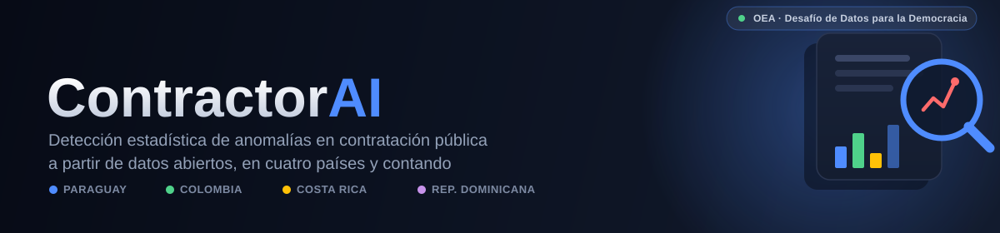

<div align="center">
  

  <p></p>

  [](LICENSE)
  [](backend/README.md)
  [](frontend/README.md)
  [](backend/tests)
  [](https://contractor-ai-one.vercel.app)
  [](https://contractor-ai-api.onrender.com/docs)
</div>

<br/>

**Contractor AI** compares every public contract it ingests against
thousands of similar historical contracts and flags the ones whose price
doesn't add up — using open data, transparent statistics, and no
black-box "trust me" scoring. It currently covers **Paraguay, Colombia,
Costa Rica, and República Dominicana** (15,000+ contracts and counting),
with a public dashboard, an institution-ranking board, a channel for
citizens to flag or add context on any contract, and a live tool to check
whether a contract that isn't in the dataset yet looks priced fairly.

It's built for the OEA's **[Desafío de Datos para la Democracia](https://www.oas.org)**
(25 years of the Inter-American Democratic Charter) and designed to keep
working — and scaling to more countries — long after that.

<p align="center">
  <a href="https://contractor-ai-one.vercel.app"><b>Live app →</b></a> ·
  <a href="https://contractor-ai-api.onrender.com/docs"><b>API docs →</b></a> ·
  <a href="#getting-started"><b>Run it locally ↓</b></a>
</p>

---

## What it does

| | |
|---|---|
| 🔎 **Anomaly detection** | Every contract is scored with a modified z-score + Tukey IQR fences over `log(amount)`, computed against peers grouped by buyer → category → country (whichever has enough data). Robust to outliers, fully explainable — no ML confidence score pretending to be more certain than it is. |
| 📄 **Analyze a new contract** | Upload a PDF, paste a link, or (soon) a photo. Text/amount extraction runs server-side; the amount gets compared live against the same statistical baseline the rest of the app uses. Nothing here claims to run a live AI model — see [`backend/app/analysis.py`](backend/app/analysis.py)'s docstring for exactly what is and isn't happening. |
| 📊 **Dashboard** | Aggregate metrics, contracts/anomaly-rate trend by year, top categories, a cross-country comparison, and CSV export. |
| 🏆 **Institution ranking** | The procuring institutions with the *strongest* track record (lowest anomaly rate, minimum sample size) — a "who's doing this well" board, not a shame list. |
| 🗣️ **Citizen participation** | Anyone can flag a concern or add context on any contract, no login required. |
| 🌙 **Light/dark theme** | Light by default, with a persisted toggle. |

## Architecture

```
frontend/   Next.js 15 (App Router) + React 19, plain CSS with custom
            properties for theming — no Tailwind/shadcn dependency.
backend/    FastAPI + SQLAlchemy 2.0, Postgres in production / SQLite
            for local dev. Read-only endpoints, a live comparison
            endpoint, a dashboard aggregation module, citizen reports.
backend/scripts/   One ingestion script per country's data source (live
            APIs where available), plus the statistical anomaly job that
            scores every contract that doesn't have a signal yet.
docs/       Architecture plan, ADRs, and a live PROGRESS.md/CHANGELOG.md
            pair documenting what's actually been built and why.
```

Full design rationale: [`docs/architecture/PLANNING.md`](docs/architecture/PLANNING.md) ·
decision records: [`docs/adr/`](docs/adr/) · what's built and what's next:
[`PROGRESS.md`](PROGRESS.md) / [`CHANGELOG.md`](CHANGELOG.md).

## Data sources

| Country | Source | Notes |
|---|---|---|
| 🇵🇾 Paraguay | DNCP historical dataset (OCDS) | Amounts CPI-adjusted to a reference year for the original prediction model — see [`backend/README.md`](backend/README.md#note-on-amount_usd). |
| 🇨🇴 Colombia | SECOP II live API (datos.gov.co) + a processed third-party dataset | No verified per-contract exchange rate — shown in original COP. |
| 🇨🇷 Costa Rica | SICOP / Observatorio de Compra Pública, live | Updated daily; USD conversion done by the official source. |
| 🇩🇴 República Dominicana | DGCP live API | Shown in original DOP. |

Every anomaly is scored two independent ways where data allows: an NLP
model's deviation from its predicted price (only where a precomputed
prediction exists), and an always-available statistical method (median +
MAD) that runs on every contract regardless. See ADR 0003 for why those two
signals are kept deliberately separate instead of blended into one score.

## Getting started

Requires Python 3.12+ and Node 20+.

```bash
# backend
cd backend
python -m venv .venv && source .venv/Scripts/activate   # .venv/bin/activate on Linux/Mac
pip install -r requirements.txt
python scripts/migrate_dataset.py      # loads Paraguay's historical dataset into SQLite
uvicorn app.main:app --reload --port 8000

# frontend (separate terminal)
cd frontend
cp .env.local.example .env.local       # NEXT_PUBLIC_API_URL=http://localhost:8000
npm install
npm run dev
```

Open http://localhost:3000. API docs at http://localhost:8000/docs.
Full details, environment variables, and how to pull in the other 3
countries' live data: [`backend/README.md`](backend/README.md) ·
[`frontend/README.md`](frontend/README.md).

### Running the tests

```bash
cd backend
pip install -r requirements-dev.txt
pytest
```

Runs against an isolated, throwaway SQLite database — never against
whatever `DATABASE_URL` your `.env` happens to point at, even if that's a
real Postgres instance. See [`backend/tests/conftest.py`](backend/tests/conftest.py).

## Security

Public write endpoints (link-based contract extraction, citizen reports)
get real scrutiny: an SSRF guard with redirect re-validation, rate
limiting, honeypots, and pinned dependencies. Full writeup, including the
one known residual gap that's disclosed rather than hidden:
[`SECURITY.md`](SECURITY.md).

## Origin

Contractor AI started as a Streamlit prototype fine-tuning a multilingual
BERT model to predict fair pricing for Paraguayan public tenders, aimed at
helping MSMEs bid more competitively — built with **VIGIA**, **ASEPY**, and
**REACCIÓN** in Paraguay, informed by prior work at Observatorio Fiscal
(Colombia). That prototype is still live at
[hack-corruption-contractor.streamlit.app](https://hack-corruption-contractor.streamlit.app/).
It's since grown into the public, multi-country platform described above —
see ADR 0001 for why, and how the two coexist during the transition.

## Team

CEO & Forward Deploy Engineer — Yefry Nunez · CTO & AI Engineer — Natalia
Ramírez Pérez · Chief of Information — Domingo Aybar Santos · Chief of
Politics — Nicole Checo · Chief of Financial — Jomayris Rosario Medina ·
plus Cristian Sosa, Dayanni Olivo, Daniel Duque, and Daniel Sosa. Full
profiles on the [live site](https://contractor-ai-one.vercel.app).

## License

[MIT](LICENSE)
