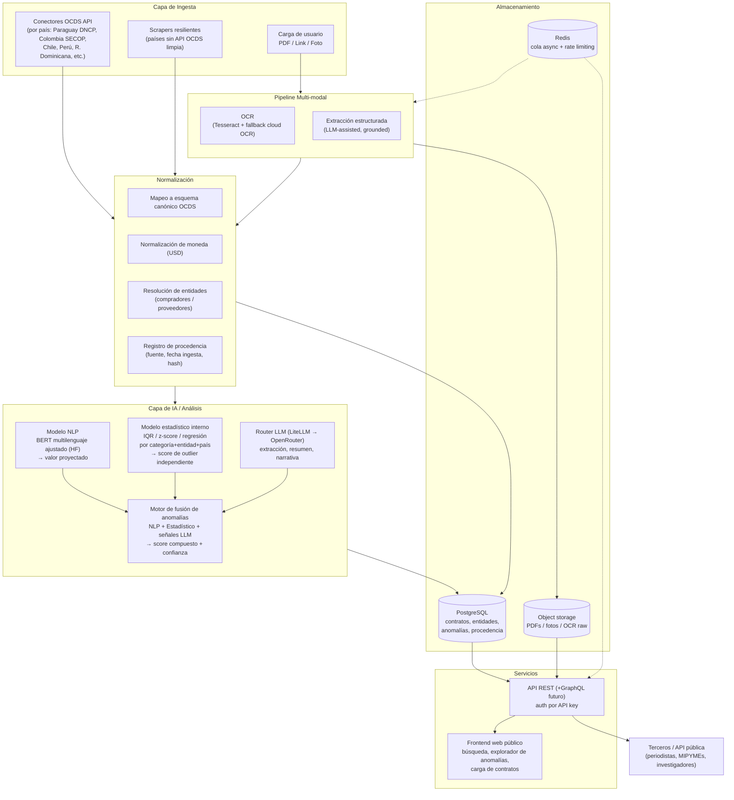
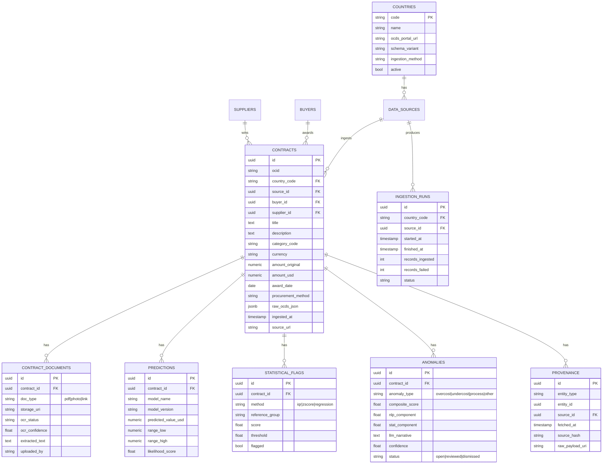

# Contractor AI — Plan de Plataforma Pública (Fase 0)

> Estado: Fase 0 completada — este documento es el entregable de planificación.
> Punto de partida: prototipo validado en Streamlit (`main.py`) sobre 3.55M+ contratos,
> modelo BERT multilenguaje ajustado + XGBoost (`Models/modelxgboost.pkl`) para predecir
> valor de referencia, y notebooks de entrenamiento/preprocesamiento para Paraguay y
> Colombia (`Code/main_colombia.ipynb`). Este plan evoluciona ese prototipo a una
> plataforma pública, multi-país, multi-modal, con API abierta.

## 1. Diagrama de arquitectura

**Flujo resumido:** ingesta (API oficial / scraper / carga multimodal del usuario) →
normalización a esquema canónico con registro de procedencia → doble análisis
independiente (NLP predice valor de referencia; modelo estadístico calcula outlier
score sin depender del NLP) → fusión en un score de anomalía con explicación →
almacenamiento en Postgres + object storage → expuesto vía API pública y frontend.

## 2. Stack técnico recomendado

| Componente | Elección | Justificación |
|---|---|---|
| Backend/API | **FastAPI (Python)** | El equipo ya trabaja en Python (pandas, transformers, xgboost, streamlit). Evita reescribir/serializar modelos ML entre lenguajes; OpenAPI automático facilita la API pública documentada. |
| Base de datos | **PostgreSQL** | JSONB para campos variables de OCDS por país + integridad relacional para contratos/entidades/anomalías. Soporta búsqueda full-text básica (`pg_trgm`/`tsvector`) suficiente para el MVP. |
| Búsqueda a escala (futuro) | Meilisearch u OpenSearch | Solo cuando el volumen/latencia de búsqueda lo justifique; no es necesario en Fase 1-2. |
| Almacenamiento de objetos | **S3-compatible** (AWS S3 o MinIO self-hosted) | PDFs, fotos y artefactos OCR crudos; lifecycle rules para controlar costo. |
| Orquestación de pipelines | **Prefect** | Nativo en Python, menor sobrecarga operativa que Airflow para un equipo pequeño, buen manejo de reintentos por país/fuente. |
| Cola / trabajos async | **Redis + RQ/Celery** | Ingesta multimodal (OCR, llamadas LLM) no debe bloquear la API; permite feedback de progreso al usuario. |
| Modelo NLP | **Hugging Face `transformers`** (el BERT ya ajustado) | Reutiliza el trabajo ya validado sobre 3.55M contratos; versionar en HF Hub privado o registro de modelos (MLflow) para reproducibilidad. |
| Enrutamiento LLM | **LiteLLM (proxy self-hosteable) sobre OpenRouter + claves directas** | OpenRouter da amplio catálogo de modelos, pero atarse a un solo agregador es un punto único de falla/costo. LiteLLM permite reglas de enrutamiento por costo/latencia/calidad en código, fallback entre proveedores, y no impide seguir usando OpenRouter como un proveedor más. Evaluar "omniroute" u otros si aportan algo que LiteLLM no cubra, pero no bloquear Fase 0 en esa evaluación. |
| OCR | **Tesseract (baseline, open-source)** + fallback a Document AI/Textract en páginas de baja confianza | Los documentos de contratación suelen tener tablas; el fallback cloud mejora extracción estructurada cuando Tesseract falla, sin depender de él para todo el volumen. |
| Modelo estadístico | **scipy / statsmodels / scikit-learn** | Sin dependencias externas de pago; es la capa de validación cruzada independiente exigida por el diseño (no debe depender de LLM ni de terceros). |
| Frontend | **Next.js + TypeScript** | Producto público con necesidad de SEO (periodistas/ciudadanos buscando contratos), server rendering, ecosistema maduro para tablas/filtros/carga de archivos. El Streamlit actual queda como herramienta interna de análisis, no como producto público. |
| Auth API pública | API keys propias + rate limiting (Redis token bucket) | No se necesita OAuth completo para v1; simple de auditar y suficiente para uso programático de terceros. |
| Infra | Docker Compose (dev) → PaaS gestionado (Render/Fly.io) o VM única (prod inicial) | Proyecto cívico con equipo y presupuesto reducidos; Kubernetes solo se justifica cuando el tráfico/escala lo requiera. |
| CI/CD | GitHub Actions | Estándar, gratuito para OSS, se integra con el patrón de loop descrito (tests antes de cada fase). |
| Observabilidad | Sentry (errores) + Prometheus/Grafana o servicio hosteado económico | Presupuesto limitado; priorizar errores y disponibilidad de la API pública. |
| Migraciones | Alembic | Versionado de esquema por país a medida que se agregan variantes de OCDS. |

## 3. Modelo de datos

Tablas adicionales sin relación gráfica directa: `api_keys` (owner_email, key_hash,
tier, rate_limit, revoked_at) para el acceso programático de terceros.

**Nota de procedencia:** toda fila en `contracts`, `contract_documents` y `predictions`
debe poder trazarse hasta un registro en `provenance` (fuente exacta, fecha de ingesta,
hash del payload crudo) — es un requisito no negociable para una herramienta que hace
señalamientos públicos sobre contratación.

## 4. Roadmap por fases

| Fase | Duración estimada | Entregable |
|---|---|---|
| **Fase 0** (completada) | — | Este plan. |
| **Fase 1** | 4–6 semanas | Un solo país (Paraguay) + API de solo lectura. Migrar el dataset ya existente (`Data/resultados finales/resultados.xlsx`, 3.55M contratos) a Postgres; exponer `/contracts`, `/contracts/{id}`, `/anomalies` vía FastAPI; frontend mínimo en Next.js consumiendo esa API. Sin ingesta en vivo todavía — el dataset estático es la base. |
| **Fase 2** | 4–6 semanas | Ingesta multi-país en vivo. Conectores OCDS API para países con API limpia (Colombia SECOP, Chile, R. Dominicana, etc.), normalización a esquema canónico, orquestación con Prefect, actualización incremental, dashboard de calidad de datos por fuente. |
| **Fase 3** | 6–8 semanas | Ingesta multi-modal (PDF / link / foto). Endpoint de carga, cola async, pipeline OCR, extracción estructurada asistida por LLM (grounded, sin inventar cifras), feedback de confianza al usuario, ruta a revisión manual si la confianza es baja. |
| **Fase 4** | 4–6 semanas | Scraping para países sin API OCDS limpia. Revisión de términos de servicio por país **antes** de activar cada scraper, framework resiliente (Scrapy/Playwright) con rate limiting respetuoso y detección de cambios de estructura. |
| **Fase 5** | 6–8 semanas | Modelo estadístico interno formalizado + validación cruzada NLP vs. estadístico (ver §6), tablero de discrepancias entre modelos, ajuste de umbrales, métricas de precisión sobre baseline de 3.55M. |
| **Fase 6** | 4–6 semanas | Endurecimiento de la API pública (rate limiting, developer portal, documentación OpenAPI), enrutamiento LLM multi-modelo por costo/latencia/calidad, revisión de seguridad, lanzamiento público. |

Cada fase es desplegable de forma independiente y no bloquea a las anteriores: Fase 1
ya es un producto usable (búsqueda + anomalías de Paraguay) antes de que exista
ingesta multi-país o multimodal.

## 5. Riesgos identificados y mitigación

1. **Disponibilidad/calidad de datos por país** — distinto grado de cumplimiento OCDS,
   campos faltantes, formatos de fecha/moneda inconsistentes.
   *Mitigación:* validación de esquema por país en la ingesta, cuarentena de registros
   inválidos (no se descartan silenciosamente), dashboard de calidad de datos por fuente.
2. **Precisión de OCR** en documentos escaneados/fotos de baja calidad.
   *Mitigación:* umbral de confianza explícito, fallback a OCR cloud en páginas dudosas,
   marcar como "revisión sugerida" en vez de bloquear, permitir corrección por el usuario.
3. **Límites de tasa / bloqueo de portales oficiales.**
   *Mitigación:* respetar `robots.txt` y límites publicados, ingestión incremental (no
   full scrape repetido), backoff exponencial, cache local de lo ya ingerido.
4. **Riesgo legal / términos de uso del scraping.**
   *Mitigación:* revisión de ToS por país antes de activar cada scraper (registrado como
   ADR por país), preferir siempre la API oficial cuando exista, documentar base legal
   (dato público / marco PIDA-OCDS) por fuente, plan de baja inmediata si un portal lo
   prohíbe explícitamente.
5. **Alucinación del LLM en el análisis.**
   *Mitigación:* el LLM **nunca** es la única fuente del score de anomalía — siempre
   corroborado por el modelo estadístico independiente (ver ADR 0003); toda narrativa
   generada se marca explícitamente como "generado por IA, verificar"; el prompt está
   *grounded* en campos ya calculados, no se permite que el LLM invente cifras.
6. **Falsos positivos/negativos dañando la reputación de proveedores** — riesgo serio en
   una plataforma pública que señala posibles irregularidades.
   *Mitigación:* nunca declarar "corrupción confirmada", usar lenguaje de "anomalía
   estadística que amerita revisión", canal de disputa/corrección para proveedores,
   revisión humana antes de cualquier acción pública de alto impacto.
7. **Deriva del modelo NLP entre países** — el BERT ajustado con datos de
   Paraguay/Colombia puede no generalizar a países sin datos de entrenamiento.
   *Mitigación:* métricas de error por país, fine-tuning incremental por país, fallback
   al modelo estadístico puro en países sin suficiente historial de entrenamiento.
8. **Seguridad de la API pública / abuso.**
   *Mitigación:* rate limiting por API key, monitoreo de patrones de tráfico anómalo.
9. **Costo de LLM a escala** (3.55M+ contratos y creciendo).
   *Mitigación:* el LLM se usa solo donde aporta (extracción no estructurada, resúmenes),
   no para cada contrato — el score de anomalía es NLP+estadístico; enrutamiento a
   modelos baratos para tareas simples vía LiteLLM.
10. **Datos personales en documentos escaneados** (fotos de cédulas, firmas).
    *Mitigación:* pipeline de redacción/PII antes de almacenar permanentemente, política
    de retención explícita, revisión de cumplimiento por país.

## 6. Estrategia de validación de precisión

- **Baseline congelado:** los 3.55M contratos ya procesados (`resultados.xlsx`) se
  versionan como snapshot de referencia. Cualquier cambio de modelo se compara contra
  este baseline antes de desplegarse — no debe degradar sin justificación explícita
  registrada en un ADR.
- **Proxy de verdad:** no existen etiquetas confirmadas de corrupción a esta escala, así
  que se construye un conjunto pequeño pero de alta confianza a partir de casos ya
  documentados públicamente (sanciones, auditorías publicadas, casos de prensa) y se
  mide *recall* del sistema sobre ese conjunto.
- **Validación cruzada NLP vs. estadístico:** contratos donde ambos modelos coinciden en
  anomalía = alta confianza; donde divergen = cola de revisión curada por humanos, que
  además sirve para refinar umbrales y detectar sesgos sistemáticos de uno u otro modelo.
- **Métricas:** precisión/recall/F1 sobre el conjunto de alta confianza, tasa de acuerdo
  entre modelos (Cohen's kappa), distribución de scores por categoría/entidad para
  detectar sobre-señalamiento sistemático de una entidad o categoría específica.
- **Circuito de feedback:** revisores humanos (periodistas, DNCP, proveedores en
  disputa) pueden marcar falso positivo/negativo vía la plataforma o la API; esos labels
  alimentan reentrenamientos periódicos.
- **Shadow mode:** todo modelo nuevo corre en paralelo sin afectar el score público
  hasta validar que no degrada el baseline congelado.

## 7. Plan de despliegue

- **Ambientes:** dev (docker-compose local) → staging (réplica de prod con datos de un
  solo país, para validar pipelines antes de exponerlos) → producción.
- **Fase 1:** backend+DB en un PaaS pequeño (Render/Fly.io) o VM única; frontend en
  Vercel/Netlify (nivel gratuito válido para OSS); dataset estático cargado una vez.
- **A partir de Fase 2:** los pipelines de ingesta corren como jobs programados
  (Prefect) separados del servicio web — si un país falla, no debe afectar la API.
- **Migraciones** versionadas con Alembic, una por cambio de esquema (incluye
  variantes de esquema por país).
- **CI/CD:** GitHub Actions ejecuta tests → build → despliegue automático a *staging*.
  El despliegue a **producción requiere un paso manual explícito** (tag/release) —
  esto es una excepción intencional al modo de operación autónomo del resto del
  desarrollo: es una plataforma pública que hace señalamientos sobre entidades y
  proveedores reales, así que el paso a producción es el único gate humano
  obligatorio del flujo, y debe quedar así documentado en `PROGRESS.md`.
- **Backups:** automáticos de Postgres (diarios) y versionado del object storage.
- **Rollback:** build anterior siempre desplegable con un comando; sin despliegues
  irreversibles sin backup previo.

## 8. Bloqueos conocidos de entrada (Fase 1)

Ver `PROGRESS.md` para el registro vivo de bloqueos. De entrada se anticipan:

- Clave de API de OpenRouter (o proveedor LLM equivalente) — no simular, registrar como
  bloqueado hasta que se provea.
- Credenciales/acceso a object storage (S3 o equivalente) para producción.
- Confirmación de qué países, además de Paraguay y Colombia, tienen API OCDS
  suficientemente limpia para Fase 2 (requiere relevamiento, no es un bloqueo de
  credencial pero sí de decisión de alcance).
